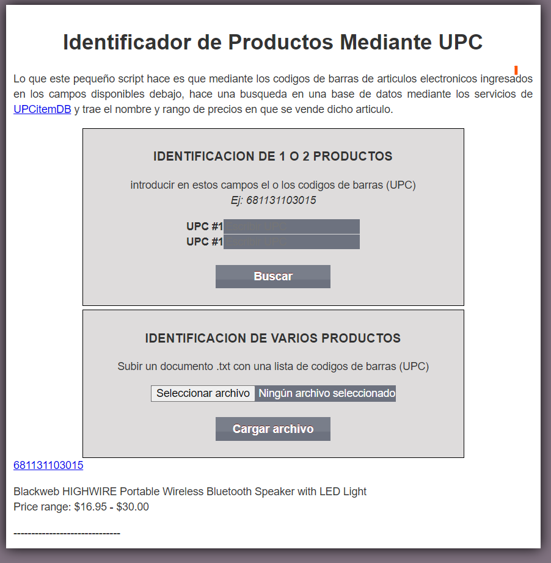

# 🔎 Identificador de Productos mediante UPC

\[\]
\[\]
\[\]
\[\]

Aplicación web desarrollada en **PHP** que permite identificar productos
electrónicos utilizando su **código de barras (UPC)**.

El sistema consulta información de productos mediante la **API de
UPCitemDB**, obteniendo datos como:

- Nombre del producto
- Descripción del producto
- Rango estimado de precios de venta en el mercado

La aplicación permite realizar **búsquedas individuales o masivas**
utilizando códigos UPC.

---

# 📸 Vista previa

La siguiente imagen muestra la interfaz principal de la aplicación.



---

# ✨ Características

- 🔍 Identificación de productos mediante **códigos UPC**
- 🌐 Consulta automática usando **UPCitemDB API**
- 💲 Obtención del **rango de precios de mercado**
- 📦 Búsqueda de **1 o 2 productos manualmente**
- 📄 Procesamiento de **listas masivas de códigos**
- ⬆️ Subida de archivos `.txt` con múltiples UPC
- ⚡ Interfaz simple y ligera

---

# 🛠 Tecnologías utilizadas

Este proyecto fue desarrollado utilizando:

- **PHP**
- **HTML5**
- **CSS3**
- **API REST**
- **UPCitemDB API**
- **HTTP Requests**

---

# ⚙️ Cómo funciona

1.  El usuario introduce uno o dos **códigos UPC** manualmente.
2.  También puede subir un archivo `.txt` con múltiples códigos.
3.  El sistema envía una solicitud a la **API de UPCitemDB**.
4.  La API devuelve la información disponible del producto.
5.  La aplicación muestra:

- Nombre del producto
- Rango de precios en el mercado

---

# 📥 Ejemplo de búsqueda

UPC introducido:

    681131103015

Resultado:

    Blackweb HIGHWIRE Portable Wireless Bluetooth Speaker with LED Light
    Price range: $16.95 - $30.00

---

# 📂 Búsqueda masiva

Puedes subir un archivo `.txt` con múltiples códigos UPC.

Ejemplo:

    681131103015
    012345678905
    889842640123

La aplicación procesará todos los códigos y devolverá los resultados
disponibles.

---

# 🚀 Instalación

Clonar el repositorio:

```bash
git clone https://github.com/nvidiati/UPC-identify.git
```

Mover el proyecto a tu servidor web:

Ejemplo:

    /var/www/html/upc-identify

Abrir en el navegador:

    http://localhost/upc-identify

---

# 📁 Estructura del proyecto

    UPC-identify
    │
    ├── index.php
    ├── search.php
    ├── upload.php
    ├── css/
    ├── js/
    ├── docs/
    │   └── screenshot.png
    └── README.md

---

# 👨‍💻 Autor

**Kris Bell**

GitHub:\
https://github.com/nvidiati

---

# 📄 Licencia

Este proyecto está distribuido bajo la licencia **MIT**.
